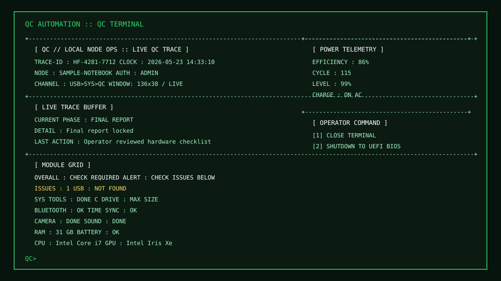

# USB QC Automation

USB/하드웨어 출고 전 QC 체크리스트를 터미널 대시보드 흐름으로 정리한 Windows Batch 자동화 스크립트입니다.

## Problem

- 출고 전 QC에서 USB 인식, 드라이브 상태, 배터리, Bluetooth, 카메라, 사운드, 시스템 정보를 반복 확인해야 합니다.
- 여러 Windows 도구를 따로 실행하면 점검 흐름이 끊기고 항목 누락이 생길 수 있습니다.
- 일반 장비와 렌탈 장비의 점검 기준이 다릅니다.

## Solution

- QC 확인 항목을 하나의 터미널 흐름으로 묶었습니다.
- Batch에서 PowerShell 명령을 호출해 배터리와 시스템 정보를 확인합니다.
- 일반 QC와 렌탈 QC 스크립트를 분리했습니다.
- 최종 상태를 한 화면에서 확인할 수 있게 구성했습니다.

## Tech Stack

| Area | Stack |
| --- | --- |
| Runtime | Batch |
| System commands | PowerShell, Windows built-in tools |
| UI | Terminal dashboard |
| Platform | Windows |

## Skills

- Windows Batch 자동화
- Batch 안에서 PowerShell 명령 호출
- Windows 장치/시스템 정보 확인
- 터미널 기반 점검 흐름 구성
- 장비 유형별 스크립트 분리
- 공개용 저장소에서 운영 식별 정보 제거

## Included Scripts

| Script | Purpose |
| --- | --- |
| `usb-qc-auto-check.bat` | 일반 QC 점검 |
| `rental-usb-qc-auto-check.bat` | 렌탈 장비 QC 점검 |

## Key Features

- USB 드라이브 탐지
- Windows 시스템 도구 실행
- C 드라이브 확장 상태 확인
- Bluetooth 상태 확인
- 배터리 상태, 효율, 사이클, 충전 상태 확인
- 시간 동기화 확인
- 카메라와 사운드 테스트 실행
- RAM, CPU, GPU 정보 표시
- 최종 리포트 화면
- UEFI BIOS 재부팅 옵션

## Preview



공개 저장소용 샘플 화면입니다. 실제 장비명, 점검 로그, 운영 식별 정보는 포함하지 않았습니다.

## Run

일반 QC:

```bat
usb-qc-auto-check.bat
```

렌탈 QC:

```bat
rental-usb-qc-auto-check.bat
```

미리보기:

```bat
usb-qc-auto-check.bat --preview
usb-qc-auto-check.bat --preview-final
```

## Project Structure

```text
usb-qc-automation/
├── usb-qc-auto-check.bat
├── rental-usb-qc-auto-check.bat
├── README.md
└── .gitignore
```

## Safety

- 스크립트 마지막에는 작업자 선택에 따라 `shutdown /r /fw /t 0` 명령으로 UEFI BIOS 재부팅을 실행할 수 있습니다.
- 실제 장비에서 실행하기 전에 스크립트 내용을 확인해야 합니다.
- 공개 저장소에는 비밀번호, API 토큰, 네트워크 공유 계정 정보, 운영 식별 문자열을 포함하지 않습니다.
